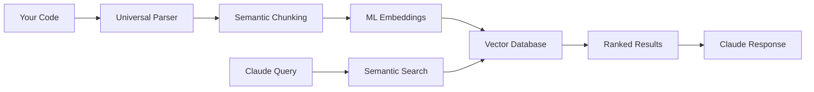

# MCP RAG Indexer

**Zero-configuration universal RAG code indexing for Claude via MCP**

[](https://www.npmjs.com/package/mcp-rag-indexer)
[](https://github.com/your-org/mcp-rag-indexer)
[](LICENSE)

Transform any codebase into a searchable knowledge base for Claude Code with a single command. No Python setup, no configuration needed.

## 🚀 Quick Start

```bash
# Install globally
npm install -g mcp-rag-indexer

# That's it! Claude Code is automatically configured.
# Restart Claude Code and start using:
# "Index my project at /path/to/code"
# "Find authentication functions"
```

## ✨ Features

- **🔍 Universal Code Search**: Semantic + exact matching across 15+ languages
- **⚡ Zero Configuration**: Works immediately after `npm install -g`
- **🐍 No Python Required**: Embedded Python runtime included
- **🧠 Offline Models**: Pre-bundled ML models, no downloads needed
- **🔄 Git Integration**: Automatic change tracking and incremental updates
- **🌍 Cross-Platform**: Windows, macOS, Linux (x64, ARM64)
- **🚫 No Dependencies**: Self-contained, no external parser requirements

## 📋 Requirements

- **Node.js**: 16.0.0 or higher
- **Claude Code**: Latest version
- **Platforms**: Windows x64, macOS x64/ARM64, Linux x64/ARM64

## 📦 Installation

### Global Installation (Recommended)

```bash
npm install -g mcp-rag-indexer
```

The installer will:
1. ✅ Validate your platform
2. ✅ Set up embedded Python runtime
3. ✅ Configure Claude Code automatically
4. ✅ Test the installation

### Verify Installation

```bash
mcp-rag-indexer --version
mcp-rag-indexer --status
mcp-rag-indexer --validate
```

## 🎯 Usage

### In Claude Code

After installation, restart Claude Code completely. The MCP server will be automatically available.

```
"Index the codebase at /home/user/my-project"
```

```
"Find functions that handle user authentication"
```

```
"Show me all database connection code"
```

```
"What are the main classes in this project?"
```

### CLI Commands

```bash
# Show version and status
mcp-rag-indexer --version
mcp-rag-indexer --status

# Validate installation
mcp-rag-indexer --validate

# Reconfigure Claude integration
mcp-rag-indexer --configure

# Run with debug logging
mcp-rag-indexer --log-level debug
```

## 🔧 Configuration

Configuration is stored in `~/.mcp-rag-indexer/config.json`:

```json
{
  "version": "1.0.0",
  "logLevel": "info",
  "modelName": "sentence-transformers/all-MiniLM-L6-v2",
  "maxCacheSize": 1000,
  "maxProjects": 50,
  "pollInterval": 30,
  "chunkSize": 1000,
  "chunkOverlap": 200,
  "offlineMode": true,
  "autoUpdate": true
}
```

## 🌐 Supported Languages

**Full Support** (semantic + structural parsing):
- Python, JavaScript, TypeScript, Java, C#, C++, C, Go, Rust, PHP, Ruby, Swift, Kotlin, Scala, R

**Text Support** (semantic search):
- Any text-based file (Markdown, JSON, YAML, XML, SQL, etc.)

## 📊 How It Works



1. **Universal Parsing**: Pattern-based extraction works with any language
2. **Intelligent Chunking**: Context-aware splitting preserves code structure
3. **Semantic Embeddings**: ML models understand code semantics
4. **Multi-Factor Ranking**: Combines semantic similarity with exact matches
5. **Git Integration**: Tracks changes for incremental updates

## 🔍 Search Examples

| Query | What It Finds |
|-------|---------------|
| `"authentication functions"` | Login, JWT, OAuth, password validation |
| `"database connections"` | Connection pools, queries, ORM setup |
| `"error handling"` | Try-catch blocks, error classes, logging |
| `"API endpoints"` | Routes, controllers, request handlers |
| `"configuration files"` | Config classes, environment variables |

## 🛠️ Troubleshooting

### Installation Issues

```bash
# Validate installation
mcp-rag-indexer --validate

# Check status
mcp-rag-indexer --status

# Reinstall if needed
npm uninstall -g mcp-rag-indexer
npm install -g mcp-rag-indexer
```

### Claude Integration Issues

```bash
# Reconfigure Claude
mcp-rag-indexer --configure

# Check Claude config
cat ~/.claude.json

# Restart Claude Code completely
```

### Performance Issues

```bash
# Check logs
tail -f ~/.mcp-rag-indexer/server.log

# Run with debug logging
mcp-rag-indexer --log-level debug
```

### Common Issues

| Issue | Solution |
|-------|----------|
| "Command not found" | Restart terminal, check `npm bin -g` |
| "Python runtime not found" | Reinstall package |
| "MCP server not connected" | Restart Claude Code, check config |
| "Indexing fails" | Check disk space, permissions |

## 📁 File Structure

```
~/.mcp-rag-indexer/
├── config.json          # User configuration
├── server.log           # Application logs
├── databases/           # Vector databases
│   ├── project1/
│   └── project2/
└── cache/               # Temporary cache
```

## 🔒 Privacy & Security

- **Local Processing**: All data stays on your machine
- **No Telemetry**: Zero data collection (configurable)
- **Offline Operation**: Works without internet after installation
- **Secure Storage**: Vector databases stored locally

## ⚡ Performance

| Metric | Performance |
|--------|-------------|
| **Installation** | < 5 minutes |
| **Indexing Speed** | ~1000 files/minute |
| **Query Speed** | < 1 second |
| **Memory Usage** | ~200MB |
| **Disk Space** | ~400MB total |

## 🔄 Updates

```bash
# Update to latest version
npm update -g mcp-rag-indexer

# Check for updates
npm outdated -g mcp-rag-indexer
```

## 🤝 Contributing

We welcome contributions! Please see our [Contributing Guide](CONTRIBUTING.md).

### Development Setup

```bash
git clone https://github.com/your-org/mcp-rag-indexer.git
cd mcp-rag-indexer
npm install
npm run build
npm test
```

## 📄 License

MIT License - see [LICENSE](LICENSE) file for details.

## 🙏 Acknowledgments

- [MCP (Model Context Protocol)](https://github.com/modelcontextprotocol) for the foundation
- [Anthropic Claude](https://claude.ai) for the AI integration
- [LangChain](https://langchain.com) for RAG components
- [Sentence Transformers](https://www.sbert.net) for embeddings

## 📞 Support

- **Issues**: [GitHub Issues](https://github.com/your-org/mcp-rag-indexer/issues)
- **Documentation**: [Full Docs](https://github.com/your-org/mcp-rag-indexer/wiki)
- **Discussions**: [GitHub Discussions](https://github.com/your-org/mcp-rag-indexer/discussions)

---

**Made with ❤️ for the Claude Code community**